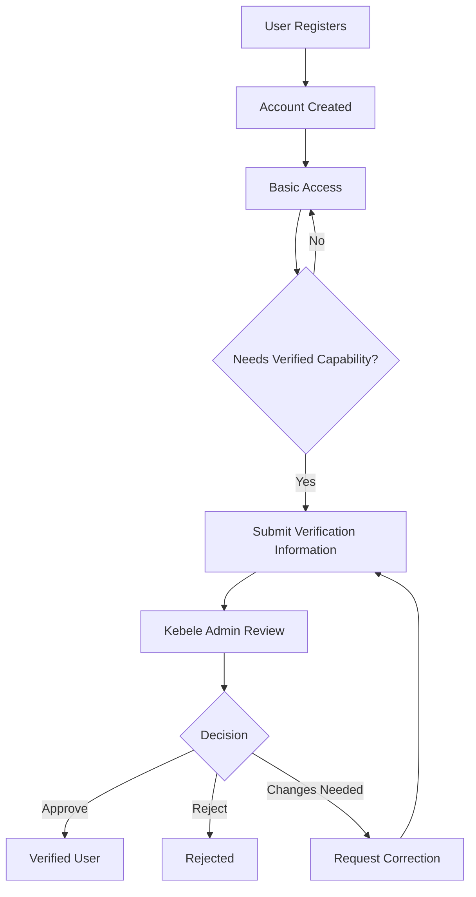
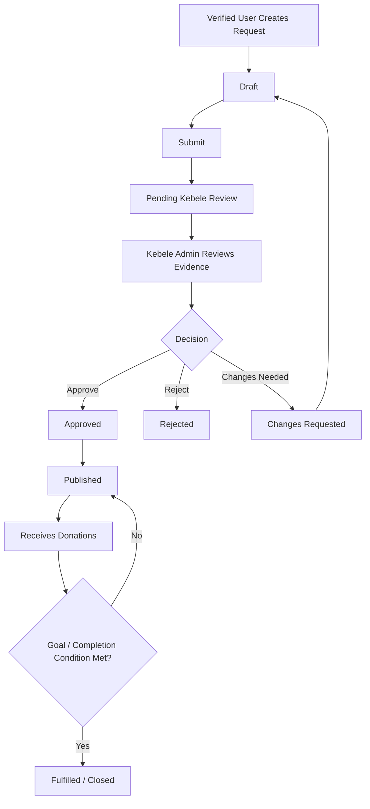
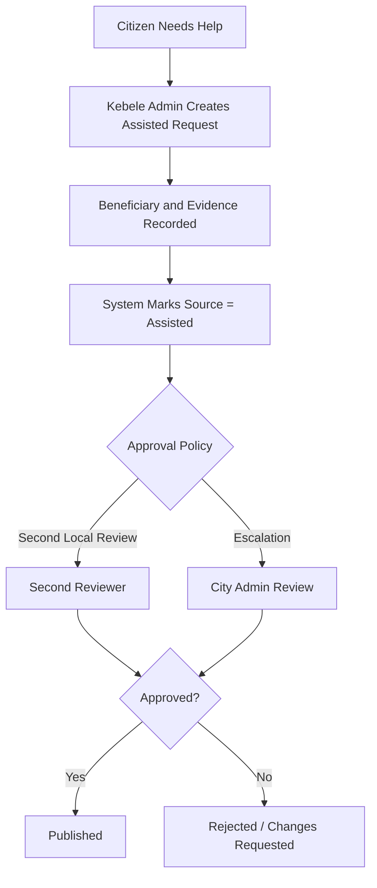
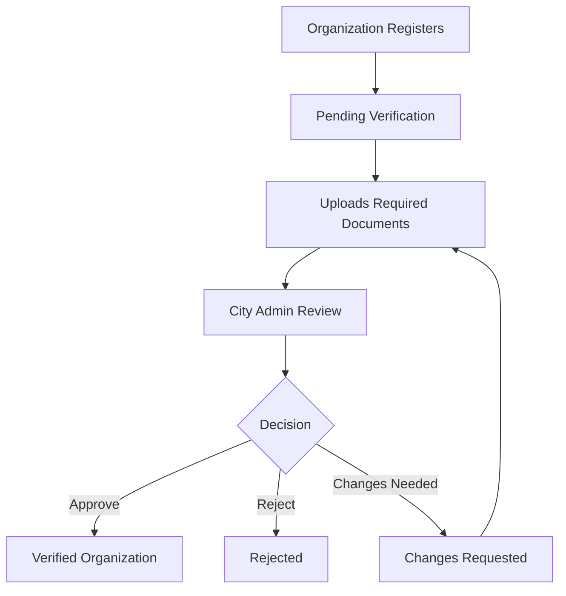
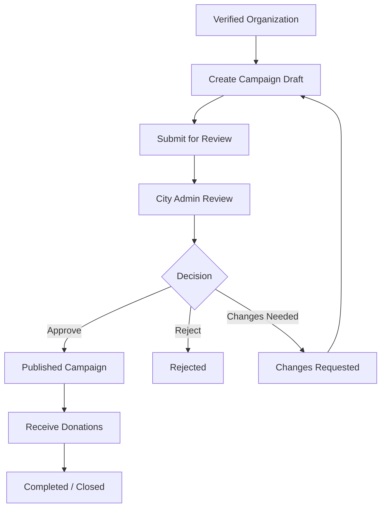

# We Donate — Roles, Verification, Approval, and Operating Model

**Document Type:** Target Operating Model and System Governance Design  
**Status:** Proposed for Team Review  
**Project:** We Donate  
**Primary Purpose:** Define a clear, professional, secure, and maintainable operating model for users, organizations, Kebele administration, City administration, and technical system administration.

---

## 1. Executive Summary

We Donate is intended to operate as a trusted donation and fundraising platform where:

- individuals can donate and request direct support;
- organizations can register, become verified, and create fundraising campaigns;
- Kebele administrators verify and assist individuals within their local jurisdiction;
- City administrators verify organizations, review organization campaigns, manage Kebele administrators, and oversee city-wide business operations;
- System administrators manage technical platform operations without acting as business approvers.

The current implementation audit identified several structural problems:

- administrative roles are currently too broad and overlap significantly;
- Kebele, Woreda, City, and Super Admin roles are not properly separated by business scope;
- organization categories are modeled as separate roles even though they behave the same;
- administrators can potentially approve resources they created themselves;
- financial records and audit logs can be permanently deleted;
- approval and publication states are not consistently enforced through a strict workflow.

The recommended target model reduces unnecessary role complexity and clearly separates:

1. **Identity and verification**
2. **Authorization and permissions**
3. **Approval of specific requests or campaigns**
4. **Technical system administration**
5. **Business administration**
6. **Financial and audit record integrity**

The recommended role model is:

- `USER`
- `ORGANIZATION`
- `KEBELE_ADMIN`
- `CITY_ADMIN`
- `SYSTEM_ADMIN`

The `WOREDA_ADMIN` role should be removed unless a real business or regulatory requirement is identified later.

Organization types such as NGO, governmental organization, nonprofit, association, or similar should be modeled as **organization categories**, not separate authorization roles.

---

# 2. Purpose of This Document

This document defines how We Donate should work as a real operational system.

It is intended to answer:

- Who uses the system?
- Who verifies whom?
- Who is allowed to create requests and campaigns?
- Who approves those requests and campaigns?
- What should each administrator be allowed to do?
- What should administrators never be allowed to do?
- How should users who cannot operate the system themselves receive assistance?
- What does a verification badge mean?
- How should financial records, approvals, and audit logs be protected?
- Which roles should remain, be merged, be removed, or be renamed?
- How should the current implementation be modified to match the intended business process?

This document is both:

- a **business-process design**, and
- a **software authorization and governance model**.

---

# 3. Current-State Findings

The existing system audit found several important implementation gaps that must be corrected before the platform can safely operate according to the intended model.

## 3.1 Administrative Hierarchy Is Currently Too Flat

The current backend treats Kebele, Woreda, City, and Super Admin roles too similarly.

This means a lower-level administrator may currently have authority over resources that should belong to a higher operational level.

### Risk

A Kebele administrator should not automatically have the same power as the City administrator.

The intended business model requires **scoped authority**, not a shared “all admins” permission group.

---

## 3.2 Organization Roles Are Duplicated

The current system contains roles such as:

- `NGO`
- `ORGANIZATION`
- `GOVERNMENTAL_ORG`

These currently perform essentially the same system function.

### Recommended correction

Use:

```text
role = ORGANIZATION
```

and store the category separately:

```text
organizationType =
  NGO
  GOVERNMENTAL
  NON_PROFIT
  ASSOCIATION
  CHARITY
  OTHER
```

A role should define **what the account can do**.

An organization type should define **what kind of organization it is**.

---

## 3.3 Self-Approval Is Possible

An administrator may currently be able to create or submit a resource and later approve that same resource.

This creates a conflict of interest and weakens trust.

### Required principle

> A person should not approve a request, campaign, or high-risk action that they created or materially modified.

---

## 3.4 Financial Record Deletion Is Too Dangerous

Donation records represent real financial activity.

Successful financial records should never disappear merely because:

- a user is deleted;
- a support request is removed;
- a campaign is removed;
- an administrator wants to clean up data.

### Required principle

> Financial records must be retained and traceable.

Business entities may be archived or deactivated, but successful financial history should remain intact.

---

## 3.5 Audit Logs Must Be Immutable

The current ability for a privileged administrator to clear audit history is not appropriate for a professional production system.

Audit history should be:

- append-only;
- protected;
- attributable to an actor;
- timestamped;
- retained according to policy.

---

## 3.6 Status Transitions Need Formal Rules

Current request and campaign statuses can be changed too freely.

A production system should not allow arbitrary transitions such as:

```text
FULFILLED -> PENDING
```

or:

```text
REJECTED -> COMPLETED
```

without a formal business reason and controlled transition.

---

# 4. Target Operating Model

The recommended operating model has three distinct trust layers.

## 4.1 Identity / Entity Verification

This answers:

> Who are you?

Examples:

- Is this individual really the person they claim to be?
- Is this organization legally or operationally legitimate?
- Does the account correspond to a real beneficiary or organization?

---

## 4.2 Authorization

This answers:

> What are you allowed to do?

Examples:

- Can this account create a support request?
- Can this organization submit a campaign?
- Can this Kebele administrator review requests in their Kebele?
- Can this City administrator create Kebele admin accounts?

---

## 4.3 Approval

This answers:

> Is this specific request or campaign acceptable?

A verified person or organization should not automatically mean that every request or campaign they create is approved.

Example:

```text
Organization verified = YES
```

does not automatically mean:

```text
New campaign approved = YES
```

These must remain separate concepts.

---

# 5. Recommended Role Model

The recommended roles are:

| Role | Main Purpose |
|---|---|
| `USER` | Individual donor and/or support requester |
| `ORGANIZATION` | Verified organization that can create fundraising campaigns |
| `KEBELE_ADMIN` | Local individual verification and direct-support administration |
| `CITY_ADMIN` | Organization, campaign, city-wide operational, and Kebele-admin governance |
| `SYSTEM_ADMIN` | Technical platform administration |

---

# 6. USER Role

## 6.1 Purpose

The `USER` role represents a normal individual using We Donate.

A user may participate as:

- a donor;
- a support requester;
- a beneficiary;
- a person whose request is submitted with Kebele assistance.

---

## 6.2 Basic User Capabilities

A registered user should be able to:

- log in;
- manage their profile;
- browse public campaigns;
- browse public individual support requests;
- donate;
- view their own donation history;
- view their own request history;
- save or follow campaigns if the feature exists;
- contact support.

---

## 6.3 Verification

User verification should be required for actions that create beneficiary risk or require identity trust.

Recommended rule:

### Unverified User

May:

- log in;
- browse public content;
- donate;
- manage profile.

May not:

- publish a personal support request;
- become a publicly listed beneficiary;
- access functions that require verified identity.

### Verified User

May additionally:

- create and submit a support request;
- be listed as a verified beneficiary;
- receive a verification badge;
- participate in other verified-user capabilities added later.

---

## 6.4 Donation Should Not Require Full Beneficiary Verification

A normal donor should not be required to go through Kebele verification merely to make a donation.

Requiring verification before donation would create unnecessary friction and reduce accessibility.

Payment-risk controls should instead be handled through:

- payment-provider validation;
- transaction monitoring;
- account status checks;
- fraud controls where required.

---

# 7. ORGANIZATION Role

## 7.1 Purpose

The `ORGANIZATION` role represents an entity that can operate fundraising campaigns.

Examples may include:

- NGO;
- governmental organization;
- charity;
- association;
- nonprofit;
- community organization;
- other recognized organization type.

These should be categories, not separate roles.

---

## 7.2 Organization Registration

Recommended workflow:

```text
Organization Registers
        ↓
Account Created
        ↓
Organization Status = PENDING_VERIFICATION
        ↓
Required Documents Submitted
        ↓
CITY_ADMIN Review
        ↓
APPROVED / REJECTED / CHANGES_REQUESTED
        ↓
If Approved
        ↓
Organization = VERIFIED
```

---

## 7.3 Organization Verification Requirements

The system should be capable of recording:

- legal or registered organization name;
- organization type;
- registration or license information;
- representative information;
- address;
- phone;
- email;
- supporting documents;
- verifier;
- verification date;
- rejection reason if rejected;
- re-verification status if important details change.

---

## 7.4 Verified Organization Capabilities

A verified organization may:

- create campaign drafts;
- submit campaigns for review;
- edit campaigns before approval;
- manage organization profile;
- view campaign performance;
- view donation information available to the campaign owner;
- communicate with platform administration;
- close or request closure of a campaign according to policy.

A verified organization should **not** be able to:

- publish an unreviewed campaign;
- modify approval records;
- approve its own campaign;
- alter successful donation history;
- access another organization's private data.

---

# 8. KEBELE_ADMIN Role

## 8.1 Purpose

The `KEBELE_ADMIN` is a local operational role.

Its primary purpose is to manage and verify **individual direct-support cases** within its own Kebele.

This role should not operate as a general platform administrator.

---

## 8.2 Core Responsibilities

The Kebele Admin should be able to:

- verify individual users within their assigned Kebele;
- review personal support requests;
- validate supporting documents;
- request corrections or additional information;
- approve or reject eligible individual requests;
- create assisted requests for individuals who cannot use the system themselves;
- view requests belonging to their assigned Kebele;
- monitor active individual support cases;
- close or escalate cases according to defined policy;
- create audit-traceable notes.

---

## 8.3 Geographic Scope

Every Kebele Admin must be linked to an assigned Kebele.

Example:

```text
user.role = KEBELE_ADMIN
user.kebeleId = <assigned kebele>
```

Backend authorization must enforce:

```text
KEBELE_ADMIN may only access resources
whose kebeleId matches the admin's assigned kebele.
```

Frontend filtering alone is not sufficient.

---

## 8.4 Assisted Support Requests

Some people may not be able to use We Donate because of:

- age;
- disability;
- low digital literacy;
- lack of smartphone;
- poor connectivity;
- emergency circumstances;
- other accessibility barriers.

The Kebele Admin should therefore have a function such as:

```text
Create Support Request on Behalf of Citizen
```

The system should record:

```text
source = ASSISTED
createdBy = KEBELE_ADMIN_ID
beneficiaryId = CITIZEN_ID, if account exists
```

or, where policy allows, a beneficiary profile independent of a login account.

The Kebele Admin must never impersonate the citizen.

The record must clearly state that it was created on behalf of the beneficiary.

---

## 8.5 Assisted Request Approval

A Kebele Admin who creates an assisted request should not silently become the sole approver.

Recommended options:

### Option A — Simple Model

Another authorized Kebele Admin reviews the request.

### Option B — Risk-Based Model

Low-risk requests may be reviewed locally.

Higher-value, sensitive, unusual, or suspicious requests are escalated to City Admin.

### Option C — Mandatory Escalation for Admin-Created Requests

Every request created by a Kebele Admin on behalf of a citizen is approved by City Admin or a second reviewer.

The final policy should balance:

- fraud prevention;
- operational speed;
- staffing availability;
- local realities.

---

# 9. CITY_ADMIN Role

## 9.1 Purpose

The `CITY_ADMIN` is the highest **business and operational administration role** within We Donate.

It should not be treated as an unrestricted technical superuser.

---

## 9.2 City Admin Responsibilities

The City Admin should be able to:

- verify organizations;
- reject organization registrations;
- request organization corrections;
- review organization campaigns;
- approve, reject, suspend, or unpublish campaigns;
- manage city-level operational policy;
- create Kebele Admin accounts;
- assign Kebele Admins to Kebeles;
- deactivate Kebele Admin accounts;
- view city-wide operational dashboards;
- handle escalated individual-support cases;
- investigate suspicious campaigns or requests;
- view audit history relevant to business operations;
- manage organization status;
- suspend abusive or fraudulent accounts;
- generate operational reports.

---

## 9.3 City Admin Should Not Have Unlimited Delete Power

The statement:

> “City Admin can do almost everything from creating to deleting”

should be refined.

A professional model should use:

- deactivate;
- archive;
- suspend;
- cancel;
- revoke;
- unpublish;

instead of destructive deletion where business history matters.

City Admin should **not** be able to:

- erase successful donation records;
- clear audit logs;
- modify payment history arbitrarily;
- change system-level secrets;
- alter database configuration;
- access raw passwords;
- bypass all approval rules;
- approve their own resource without controls.

---

# 10. SYSTEM_ADMIN Role

## 10.1 Purpose

The `SYSTEM_ADMIN` exists for technical administration.

This role replaces the broad concept of `SUPER_ADMIN`.

The role should have system-level responsibility but minimal involvement in normal donation business decisions.

---

## 10.2 Technical Responsibilities

System Admin may manage:

- platform configuration;
- deployments;
- technical service health;
- integrations;
- payment-gateway configuration;
- technical logs;
- backups;
- security configuration;
- infrastructure;
- system maintenance;
- emergency technical recovery;
- creation or management of City Admin accounts, if policy allows.

---

## 10.3 System Admin Should Not Normally

- approve individual support requests;
- approve organization campaigns;
- verify beneficiaries;
- verify organizations;
- alter successful donations;
- delete audit history;
- act as a normal business approver.

This creates proper separation between:

```text
Technical Authority
```

and:

```text
Business Authority
```

---

# 11. Recommended Permission Matrix

| Capability | USER | ORGANIZATION | KEBELE_ADMIN | CITY_ADMIN | SYSTEM_ADMIN |
|---|---:|---:|---:|---:|---:|
| Browse public content | ✓ | ✓ | ✓ | ✓ | Optional |
| Donate | ✓ | ✓ | Optional | Optional | Optional |
| Create personal support request | Verified only | ✗ | On behalf of citizen | Escalated/admin case only | ✗ |
| Review personal support request | Own only | ✗ | Own Kebele | City escalation | ✗ |
| Verify individual | ✗ | ✗ | Own Kebele | Override/escalation | ✗ |
| Create campaign | ✗ | Verified only | ✗ | Administrative only if required | ✗ |
| Review campaign | ✗ | Own only | ✗ | ✓ | ✗ |
| Verify organization | ✗ | ✗ | ✗ | ✓ | ✗ |
| Create Kebele Admin | ✗ | ✗ | ✗ | ✓ | Optional |
| Assign Kebele scope | ✗ | ✗ | ✗ | ✓ | Optional |
| Suspend campaign | ✗ | ✗ | ✗ | ✓ | Emergency technical lock only |
| View business audit logs | Own activity | Own activity | Scoped | ✓ | Security/technical only |
| Delete donation records | ✗ | ✗ | ✗ | ✗ | ✗ |
| Clear audit logs | ✗ | ✗ | ✗ | ✗ | ✗ |
| Manage integrations | ✗ | ✗ | ✗ | ✗ | ✓ |
| Manage infrastructure | ✗ | ✗ | ✗ | ✗ | ✓ |

---

# 12. Core Real-World Workflows

## 12.1 Individual Registration and Verification



---

## 12.2 Individual Support Request



---

## 12.3 Assisted Individual Support Request



---

## 12.4 Organization Verification



---

## 12.5 Organization Campaign Approval



---

# 13. Verification Badge Model

Verification badges must have a precise meaning.

A badge should not simply mean:

> “This account is safe.”

It should communicate what was actually verified.

---

## 13.1 Individual Verification Badge

Example meaning:

> **Verified Individual**  
> Identity and beneficiary information have been reviewed by the responsible Kebele administration.

Recommended metadata:

- verification status;
- verified by;
- verification date;
- Kebele;
- optional expiration/review date;
- reason for suspension or revocation if applicable.

---

## 13.2 Organization Verification Badge

Example meaning:

> **Verified Organization**  
> Organization identity and registration information have been reviewed by We Donate City Administration.

Recommended metadata:

- organization status;
- organization type;
- verification date;
- verified by;
- document-review status;
- re-verification date if required.

---

## 13.3 Badge Does Not Replace Campaign Approval

A verified organization may still create an invalid, misleading, incomplete, or inappropriate campaign.

Therefore:

```text
Verified Organization
        ≠
Automatically Approved Campaign
```

Campaign approval remains a separate workflow.

---

# 14. Recommended Status Model

Statuses should represent clear business states and only allow valid transitions.

---

## 14.1 User Verification Status

```text
UNVERIFIED
PENDING
CHANGES_REQUESTED
VERIFIED
REJECTED
SUSPENDED
```

---

## 14.2 Organization Verification Status

```text
PENDING
CHANGES_REQUESTED
VERIFIED
REJECTED
SUSPENDED
```

---

## 14.3 Support Request Status

Recommended:

```text
DRAFT
PENDING_REVIEW
CHANGES_REQUESTED
APPROVED
PUBLISHED
FULFILLED
REJECTED
CANCELLED
ARCHIVED
```

Possible simplified version if approval and publication are always performed together:

```text
DRAFT
PENDING_REVIEW
CHANGES_REQUESTED
PUBLISHED
FULFILLED
REJECTED
CANCELLED
ARCHIVED
```

The team should choose one model consistently.

---

## 14.4 Campaign Status

Recommended:

```text
DRAFT
PENDING_REVIEW
CHANGES_REQUESTED
PUBLISHED
COMPLETED
REJECTED
SUSPENDED
CANCELLED
ARCHIVED
```

---

## 14.5 Donation Status

Recommended:

```text
PENDING
SUCCESS
FAILED
REFUNDED
REVERSED
```

Donation status changes should be tightly controlled and driven by trusted payment/verification logic.

---

# 15. State Transition Rules

A backend state machine should enforce valid transitions.

Example:

```text
DRAFT
  -> PENDING_REVIEW

PENDING_REVIEW
  -> CHANGES_REQUESTED
  -> PUBLISHED
  -> REJECTED

CHANGES_REQUESTED
  -> DRAFT
  -> PENDING_REVIEW

PUBLISHED
  -> FULFILLED
  -> SUSPENDED
  -> CANCELLED

FULFILLED
  -> ARCHIVED
```

Invalid transitions should be rejected.

Example:

```text
FULFILLED -> PENDING_REVIEW
```

should not occur without a formally defined exceptional process.

---

# 16. Approval and Separation-of-Duties Rules

## 16.1 No Self-Approval

Backend logic must prevent:

```text
creatorId == approverId
```

when the action requires independent review.

---

## 16.2 No Frontend-Only Authorization

Hiding a button is not security.

Every protected action must be enforced in the backend.

Example:

```text
POST /campaigns/:id/approve
```

must verify:

- authenticated user;
- role;
- permission;
- resource scope;
- resource state;
- conflict-of-interest condition.

---

## 16.3 Scope Must Be Enforced

Example:

```text
KEBELE_ADMIN
```

should not be able to review requests from another Kebele merely by changing an ID in the API URL.

Object-level authorization is required.

---

## 16.4 High-Risk Actions May Require Escalation

The platform may later define risk-based escalation using:

- requested amount;
- fraud score;
- unusual beneficiary history;
- sensitive category;
- complaint history;
- organization risk;
- manual admin judgment.

This should be configurable policy, not uncontrolled role behavior.

---

# 17. Financial Integrity

Financial data is a special category.

## 17.1 Donation Records Must Be Preserved

A successful donation record should remain even if:

- the donor account is later disabled;
- a campaign is archived;
- a beneficiary is deactivated;
- an organization is suspended.

---

## 17.2 Use Archiving Instead of Destructive Deletion

Recommended fields may include:

```text
isActive
archivedAt
archivedBy
archiveReason
```

or a dedicated lifecycle status.

---

## 17.3 Donation Totals Must Be Derived Safely

The system must avoid inconsistent behavior such as:

- incrementing a campaign total on verification;
- later rejecting/refunding the donation;
- failing to adjust the total.

Financial totals should be reconciled from trusted transaction state or updated through controlled transaction logic.

---

# 18. Audit Logging

Audit logs should record meaningful privileged actions.

Examples:

- user verification;
- organization approval;
- organization rejection;
- campaign approval;
- campaign rejection;
- support-request approval;
- support-request rejection;
- Kebele Admin creation;
- Kebele assignment change;
- suspension;
- reactivation;
- administrative status changes;
- manual donation verification;
- refund or reversal action;
- privilege changes.

Recommended audit fields:

```text
id
actorId
actorRole
action
entityType
entityId
previousState
newState
reason
ipAddress
userAgent
createdAt
```

Audit logs should not have a normal “clear all” operation.

---

# 19. Recommended Data Ownership Model

Ownership should be explicit.

Examples:

```text
SupportRequest.ownerUserId
SupportRequest.beneficiaryId
SupportRequest.createdById
SupportRequest.kebeleId
```

Organization campaign:

```text
Campaign.organizationId
Campaign.createdById
Campaign.reviewedById
Campaign.approvedById
```

Assisted request:

```text
SupportRequest.source = ASSISTED
SupportRequest.createdById = kebeleAdminId
SupportRequest.beneficiaryId = citizenId
```

This prevents ambiguity between:

- who owns the request;
- who created it;
- who benefits from it;
- who approved it.

---

# 20. Recommended Authorization Architecture

The system should use roles plus permissions/scopes.

Do not rely everywhere on code such as:

```ts
if (
  role === "KEBELE_ADMIN" ||
  role === "CITY_ADMIN" ||
  role === "SYSTEM_ADMIN"
) {
  // allow
}
```

Instead, define business capabilities.

Example permissions:

```text
user.verify
support_request.create
support_request.create_assisted
support_request.review
support_request.approve
support_request.reject
support_request.publish

organization.verify
organization.reject
organization.suspend

campaign.create
campaign.review
campaign.approve
campaign.reject
campaign.suspend
campaign.publish

kebele_admin.create
kebele_admin.assign
kebele_admin.deactivate

audit.view
report.view
system.configure
```

Then apply scope.

Example:

```text
KEBELE_ADMIN
permission = support_request.review
scope = assigned_kebele
```

This is safer and easier to maintain than scattered role checks.

---

# 21. Role Changes Recommended

| Current Role | Recommendation |
|---|---|
| `USER` | Keep |
| `NGO` | Merge into `ORGANIZATION` |
| `GOVERNMENTAL_ORG` | Merge into `ORGANIZATION` |
| `ORGANIZATION` | Keep as the single organization role |
| `KEBELE_ADMIN` | Keep, but sharply scope permissions |
| `WOREDA_ADMIN` | Remove unless a real business need is defined |
| `CITY_ADMIN` | Keep as highest business administration role |
| `SUPER_ADMIN` | Rename/redefine as `SYSTEM_ADMIN` |

---

# 22. Roles That Should Not Exist Without a Clear Business Need

## 22.1 Woreda Admin

Do not keep a role merely because a governmental hierarchy exists in real life.

A role should exist only if the system has a clear process requiring it.

A Woreda Admin should be added only if there is a future requirement such as:

- mandatory Woreda-level review;
- cross-Kebele approval;
- regulatory reporting;
- escalation before City review;
- Woreda-specific operational ownership.

Until then, it adds unnecessary complexity.

---

# 23. Recommended Business Responsibility Map

## USER

Responsible for:

- personal account;
- personal information;
- personal support requests;
- donations.

---

## ORGANIZATION

Responsible for:

- organization profile;
- campaign drafts;
- campaign supporting documents;
- campaign updates;
- responsible fundraising behavior.

---

## KEBELE_ADMIN

Responsible for:

- individual verification;
- local beneficiary validation;
- local support-request review;
- assisted requests;
- Kebele-scoped monitoring.

---

## CITY_ADMIN

Responsible for:

- organization verification;
- organization campaigns;
- Kebele Admin governance;
- escalations;
- suspicious activity review;
- city-wide operational oversight.

---

## SYSTEM_ADMIN

Responsible for:

- technical platform operation;
- integrations;
- infrastructure;
- technical security;
- system configuration.

---

# 24. What “Delete” Should Mean

The platform should avoid one generic delete button.

Different resources need different lifecycle actions.

## Users

Use:

```text
Deactivate
Suspend
Archive
```

instead of destructive deletion.

## Organizations

Use:

```text
Suspend
Revoke Verification
Archive
```

## Campaigns

Use:

```text
Unpublish
Suspend
Cancel
Archive
```

## Support Requests

Use:

```text
Cancel
Close
Archive
```

## Donations

Never normal-delete successful records.

Use:

```text
Refund
Reverse
Mark Failed
```

through controlled financial workflows.

## Audit Logs

Never clear through normal administration.

---

# 25. Recommended Professional Controls

The following controls should be included in the target system.

## Required

- backend role authorization;
- backend resource-scope authorization;
- no self-approval;
- immutable financial history;
- immutable audit history;
- valid state-transition enforcement;
- ownership checks;
- clear verification metadata;
- rejection reasons;
- approval timestamps;
- verifier/approver identity;
- Kebele assignment;
- organization-type separation from role;
- archive/suspend instead of destructive deletion.

## Strongly Recommended

- dual review for high-risk assisted requests;
- city escalation for unusual individual cases;
- campaign suspension workflow;
- complaint/report mechanism;
- re-verification after major organization changes;
- financial reconciliation checks;
- audit report export;
- account suspension reasons;
- rate limits and anti-abuse controls.

---

# 26. Recommended Implementation Priority

## Phase 1 — Critical Security and Data Integrity

1. Remove destructive cascade deletion of donations.
2. Remove ability to clear audit logs.
3. Prevent self-approval.
4. Enforce backend scope checks.
5. Restrict Kebele Admin to assigned Kebele.
6. Implement valid state transitions.
7. Protect successful payment history.

---

## Phase 2 — Role Cleanup

1. Merge organization roles into `ORGANIZATION`.
2. Add `organizationType`.
3. Remove `WOREDA_ADMIN` unless justified.
4. Rename/redefine `SUPER_ADMIN` to `SYSTEM_ADMIN`.
5. Rebuild City Admin permissions around business operations.
6. Rebuild Kebele Admin permissions around local individual support.

---

## Phase 3 — Workflow Cleanup

1. Implement individual verification flow.
2. Implement organization verification flow.
3. Implement support-request approval flow.
4. Implement organization campaign approval flow.
5. Implement assisted support-request flow.
6. Add rejection/change-request workflow.
7. Add suspension/archive workflows.

---

## Phase 4 — Governance and Auditability

1. Improve audit-log structure.
2. Add approval history.
3. Add verification history.
4. Add reasons for administrative actions.
5. Add city/Kebele operational reports.
6. Add reconciliation and monitoring controls.

---

# 27. Decisions the Team Still Needs to Make

The following should be explicitly decided before final implementation.

## 27.1 Individual Verification

- What documents are required?
- Can every Kebele Admin verify?
- Does verification expire?
- Can City Admin override Kebele decisions?

## 27.2 Assisted Requests

- Can the creator Kebele Admin also approve?
- Is a second reviewer required?
- Which cases must escalate to City Admin?

## 27.3 Campaign Review

- What minimum documentation is required?
- Can a City Admin approve a campaign they created administratively?
- What causes suspension?
- Can approved campaigns be edited?
- Which edits require reapproval?

## 27.4 Donation Handling

- How are manual transfers verified?
- Who can verify them?
- What is the refund process?
- How are totals recalculated after refunds or reversals?

## 27.5 Account Administration

- Who creates the first City Admin?
- Can System Admin create City Admins?
- Can City Admin create another City Admin?
- What is the account recovery process?

---

# 28. Final Recommended Operating Model

The final recommended structure is:

```text
                         SYSTEM_ADMIN
                  Technical Platform Authority
                              │
                              │ technical governance
                              ▼
                         CITY_ADMIN
                 Business / Operational Authority
                    /                     \
                   /                       \
     Organization Governance        Kebele Governance
              │                           │
              ▼                           ▼
        ORGANIZATION                 KEBELE_ADMIN
              │                           │
       Campaign Creation             Individual Verification
              │                           │
       City Admin Review             Support Request Review
              │                           │
              └───────────┬───────────────┘
                          ▼
                   APPROVED / PUBLISHED
                          │
                          ▼
                        DONORS
                          │
                          ▼
              FINANCIAL RECORD + AUDIT TRAIL
```

The system should enforce a clear principle:

> **Technical administrators run the platform. City administrators govern organizations and campaigns. Kebele administrators govern local individual-support cases. Users and organizations participate in fundraising according to their verified capabilities.**

This design is simpler than the current role structure while preserving the real-world responsibilities the team described.

---

# 29. Final Recommendation

The project should move forward with five core roles:

```text
USER
ORGANIZATION
KEBELE_ADMIN
CITY_ADMIN
SYSTEM_ADMIN
```

The main structural changes are:

- keep Kebele Admin because it has a real operational responsibility;
- remove Woreda Admin unless a real approval or reporting requirement appears;
- merge NGO, governmental organization, and other organization roles into one `ORGANIZATION` role;
- keep organization type as data, not authorization;
- make City Admin the highest business authority;
- make System Admin technical, not business;
- allow Kebele Admin to assist citizens who cannot use the system;
- clearly identify assisted requests;
- prevent self-approval;
- verify individuals through Kebele;
- verify organizations through City Admin;
- separately review each organization campaign;
- allow normal users to donate without forcing unnecessary Kebele verification;
- protect financial and audit records from destructive deletion;
- enforce all authorization and scope rules in the backend.

The most important design rule is:

```text
VERIFICATION  !=  AUTHORIZATION  !=  APPROVAL
```

A verified identity proves who the actor is.

Authorization defines what the actor is allowed to do.

Approval determines whether a particular request, campaign, or administrative action is accepted.

Keeping those three concepts separate will make We Donate significantly easier to understand, secure, maintain, and scale.

---

# 30. Source Basis

This target operating model was developed from:

1. the team's stated intended business process;
2. the current `SYSTEM_ROLES_WORKFLOW_AND_APPROVAL_AUDIT.md`;
3. the identified implementation issues around admin-role overlap, organization-role duplication, self-approval, financial deletion, audit-log deletion, and unrestricted state changes;
4. standard professional design principles for role-based authorization, business-process separation, data integrity, auditability, and conflict-of-interest control.

This document defines the **recommended future-state design**. It should be reviewed and approved by the team before code or database migrations are implemented.
